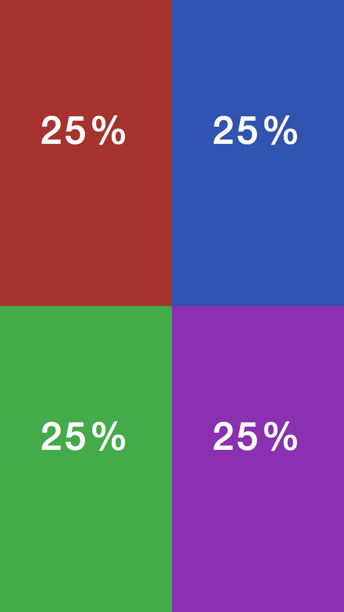

Auto Layout Alternatives
----

This project features a comparison between a few methods for programatically doing Auto Layout with code. 

The libraries used are:

Method | Description 
------ | ----------- 
[Auto Layout](https://developer.apple.com/library/ios/documentation/userexperience/conceptual/AutolayoutPG/AutoLayoutinCode/AutoLayoutinCode.html) | Apples Standard Auto Layout using the [Visual Format](https://developer.apple.com/library/ios/documentation/userexperience/conceptual/AutolayoutPG/VisualFormatLanguage/VisualFormatLanguage.html#//apple_ref/doc/uid/TP40010853-CH3-SW1)  
[Keep Layout](https://github.com/iMartinKiss/KeepLayout) | *Keep Layout makes Auto Layout much easier to use from code! No more Interface Builder or Visual Format.*
[Masonry](https://github.com/cloudkite/Masonry) | *Masonry is a light-weight layout framework which wraps AutoLayout with a nicer syntax. Masonry has its own layout DSL which provides a chainable way of describing your NSLayoutConstraints which results in layout code that is more concise and readable. Masonry supports iOS and Mac OSX.*
[UIView+AutoLayout](https://github.com/smileyborg/UIView-AutoLayout) | *UIView+AutoLayout provides a developer-friendly interface for the vast majority of Auto Layout use cases. It is designed for clarity and simplicity, taking inspiration from the Auto Layout UI options available in Interface Builder but delivering far more flexibility and capability.*

Goal
----

The goal is to make a view containing 4 equal sized viewControllers. These views should fill the main view and should adjust and work correctly in all orientations. They should also scale with the main view

